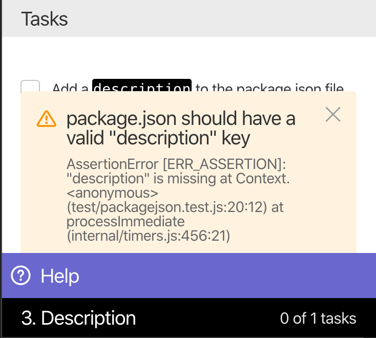
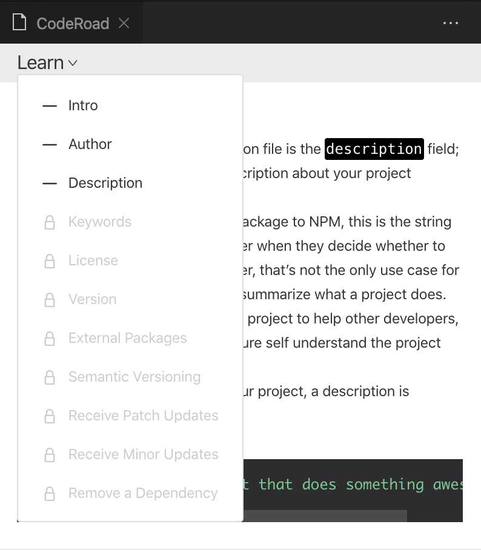
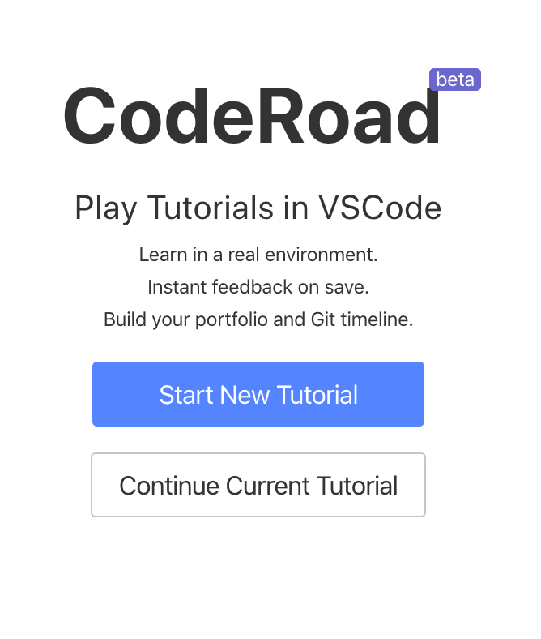

# Change Log

All notable changes to the "coderoad-vscode" extension will be documented in this file.

Check [Keep a Changelog](http://keepachangelog.com/) for recommendations on how to structure this file.

# [0.19.0]

- Add the ability to run scripts on continue to address an issue where continued tutorials weren't configured correctly.
    - adds a "continue" webhook
    - adds a `tutorial.config.continue` that lets you run `commands` or `vscodeCommands`

## [0.18.0]

- Improved error logging in output channel "CodeRoad (Logs)"

## [0.17.2]

- Bundle size down to ~1mb

## [0.17.1]

- Bundle size down to ~2mb

## [0.17.0]

- Auto-launch a continued tutorial
## [0.16.0]

- Add support for writing session state to a file. This is useful in multi-container environments where local storage is not necessarily preserved across sessions.

## [0.15.1]

- fixes bug where CodeRoad would not run in some containerized environments due to the event origin path

## [0.15.0]

- Webhook support
- Updated Settings page
- Reset tutorial button
- New env variable: CODEROAD_CONTENT_SECURITY_POLICY_EXEMPTIONS
- CodeRoad launches automatically if repo includes `codeally.json`

## [0.14.1]

- Resolve issues with error pages
- Include better errors for supporting Windows

## [0.14.0]

- Add logo to vscode marketplace
- Fixes
  - issue with watcher tests running on reset
  - issue with some commits loading multiple times on continue
  - issue with task progress not displaying correctly

## [0.13.0]

- BREAKING CHANGE:
  - `config.testRunner.setup` is now `config.setup`
  - `config.setup` runs in the root workspace directory, not the `config.testRunner.directory`
- Significant internal refactor to:
  - remove recording progress
  - simplify structure with "hooks"
- Supports commands on reset
- Supports running vscode commands anywhere that command line commands can be run
- Admin mode to allow creators to jump between tutorial levels/steps during development

## [0.12.0]

- Change completion page to a banner that prompts the user to open a new workspace
- On launch, show details on tutorial to continue
- Adds an "About" section to the tutorial side menu
- Run test indicator
- Various style & UX fixes
- Launch from URL fixes
- Move styles into a central theme
- Prevent multiple versions of CodeRoad from launching

## [0.11.0]

- Improved UI for continue
  - show overall level progress
  - popup on level completion
- Hotkey support for:
  - running tests (ctrl + enter)
  - continue (ctrl + enter)
- Fix scroll to bottom on next level
- Add a scroll indicator when content is too long

## [0.10.0]

UI redesign for the tutorial page:

- removes unnecessary headers
- adds a side panel
- step progress indicator
- removes logs from error messges

Supports "reset button" for resetting state & running a reset script.

Adds a review page for viewing tutorial content. The review page should be especially helpful for tutorial creators.

## [0.9.0]

Change subtask format to include subtasks in markdown.

Subtasks no longer need to be included in yaml, or require a filter.

See an example at <http://github.com/shmck/coderoad-tutorial-subtask-demo>

```md
### 1.1

A description of the task

#### SUBTASKS

- The first subtask
- The second subtask
```

Subtasks are then matched up with tests with names that match

```text
SUBTASK 1.1 :1 test name
SUBTASK 1.2 :2 test name

## [0.1.0]

- Initial release

## [0.2.0]

- Improvements to error handling
- Validate Git installed on startup
- Validate Git remote can connect on tutorial selection
- Fix component translation issues

## [0.2.1]

- Improves error page
- Adds tutorial dependency validation in tutorial config. See an example below:

```json
{
  "config": {
    "dependencies": [
      {
        "name": "node", // command line process to run
        "version": "^10", // see node-semver for options
        "message": "An optional message to display if the validation fails"
      },
      {
        "name": "npm",
        "version": ">=5"
      }
    ]
  }
}
```

## [0.8.0]

- Support Python with using [tap.py](https://github.com/python-tap/tappy)
- Fix paragraph spacing
- Support hints - clues that reveal on click to help guide users. Hints can be added to a step, see an example below.

```md
### 1.1

A description of the task.

#### HINTS

- The first hint
- The second hint
- The last hint
```

## [0.7.0]

- Style fixes for tables & bold markdown

- Support loading subtasks (#340). Subtasks are a list of tests that need to pass before a task is complete. They can be loaded by:

1. filtering down to a subset of tests by setting the `step.setup.filter` to a regex pattern that matches the tests you're targeting
2. setting the `step.setup.subtasks` variable to true

- Change for the test runner config. Changes are backwards compatible.

1. `testRunner.path`=> `testRunner.directory`
2. `testRunner.actions` => `testRunner.setup`
3. Change command to capture `args` for "TAP" support, and test "filter"ing support. These changes will help lead to specific test suite presets in the future.

```json
{
  "testRunner": {
    "command": "mocha",
    "args": {
      "filter": "--grep",
      "tap": "--reporter=mocha-tap-reporter"
    },
    "directory": ".coderoad",
    "setup": {
      "commits": ["410bd4f"],
      "commands": ["npm install"]
    }
  }
}
```


## [0.6.1]

- Replace checkboxes with icons

## [0.6.0]

- New configuration environment variables for web compatability

```text
CODEROAD_DISABLE_RUN_ON_SAVE=true // blocks saving on file system changes
CODEROAD_DISPLAY_RUN_TEST_BUTTON=true // adds a run test button to tutorial page
CODEROAD_TUTORIAL_URL='path/to/tutorial_config_file.json' // will load directly into tutorial
```

- Improves styles for inline code blocks

## [0.5.0]

- Show test fail messages in the webview UI



- Display error messages if React fails to load

## [0.4.0]

- Want to look back at a previous lesson's content? Navigate through text content from previous levels by clicking the "Learn" dropdown.



- Continue an incomplete tutorial started in the same workspace. Choose the "continue" path from the start screen. Progress is stored in local storage in the workspace.




## [0.3.0]

- Validate the extension version against the tutorial config version. This should allow us to manage breaking changes in tutorial schema in upcoming versions. See [node-semver](https://github.com/npm/node-semver#advanced-range-syntax) for possible version ranges and options.

```json
{
"config": {
  "appVersions": {
    "vscode": ">=0.2"
  },
}
```

- Configure the CodeRoad to load and run in a different directory. The example below will:
  - load a commit and run npm install to setup the test runner in its own folder.
  - run "npm test" in the \$ROOT/coderoad directory on save

```json
{
"config": {
  "testRunner": {
    "command": "npm test", // runs in path location or root
    "path": "coderoad",
    "actions": {
      "commits": ["a974aea"],
      "commands": ["npm install"] // runs in path location or root
    }
  },
}
```

Resulting in a folder structure like the following:

```text
- .vscode
- coderoad (test runner files only with their own setup)
  - package.json
  - tests
- package.json
- server.js
```

## [0.2.4]

- Support VSCode 1.39.2

## [0.2.3]

- Support Windows OS

## [0.2.2]

- Fixes issue where app fails on startup without a workspace, and instead returns an error page
