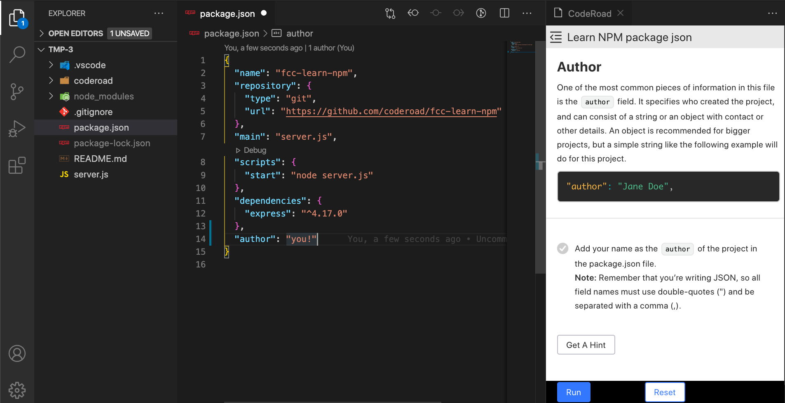

# CodeRoad VSCode

CodeRoad is a VSCode extension that allows you to play interactive coding tutorials in your editor.

## Why

Interactive learning is the most effective way to gain new skills and knowledge. CodeRoad aims to help tutorial creators develop and share interactive content with the community.

For learners, there are a number of advantages to running tutorials inside VSCode:

- learn in a real world coding environment
- get rapid feedback on save and helpful error messages
- users own the code, and can build a Git timeline and deploy a portfolio

## Getting Started

### Start

To start the extension, inside VSCode:

- open an empty VSCode workspace (an empty folder)
- launch the app from the VSCode command palette:
  - select “View” > “Command Palette” from the top panel OR press `cmd/ctrl + shift + P`
  - in the command palette, search for and run `CodeRoad:Start`
- a webview should appear on the right side of your editor. Click "Start"

### Install

Install CodeRoad from [this link in the VSCode Marketplace](https://marketplace.visualstudio.com/items?itemName=CodeRoad.coderoad).

- You may need to reload the window (`ctrl/cmd + R`)
- See ["Start"](#start) to get started.

### Requirements

- OS: MacOS, Windows, Linux
- VSCode 1.39.2+
- Node.js 10+
- Git

## How CodeRoad Works

Read more in the docs about [how CodeRoad works](https://coderoad.github.io/docs/how-coderoad-works).

## Creating Tutorials

Build and share your own interactive tutorials.

Learn more about [how tutorials area created](https://coderoad.github.io/docs/build-tutorial).

## Editing Tutorials

Tutorials can be edited directly as markdown on Github.

## Development

To run the extension locally:

- copy environmental variables from `/web-app/.env.example` as `/web-app/.env`
- install dependencies with `yarn install-all`
- build the extension with `yarn build`
- open the extension with the vscode extension debugger by pressing F5. In the new window, open CodeRoad.

To test a packaged build locally:

- if on Mac, ensure you have [VSCode command line tools](https://code.visualstudio.com/docs/setup/mac#_launching-from-the-command-line) installed
- run `yarn package`. It will build the extension and install it locally.
- open a new vscode window and launch the new version of CodeRoad

## Contributing

CodeRoad is an ambitious project, we're always looking for contributors :)

See [CONTRIBUTING.md](./CONTRIBUTING.md).

## License

[AGPL v3](./LICENSE.md)
