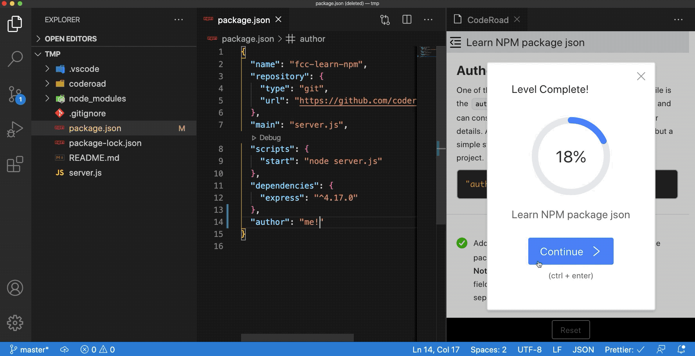
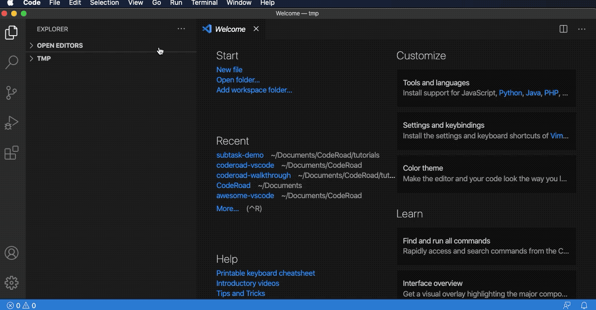

  

<h1 align="center">
CodeRoad
</h1>

  
  
   

CodeRoad is a VSCode extension that allows you to create and play interactive coding tutorials in your editor.

## [Documentation](https://coderoad.github.io/docs/overview)

## Getting Started

### Requirements

- OS: MacOS, Windows, Linux
- VSCode 1.39.2+
- Git

### Install

1. install CodeRoad from [the VSCode Marketplace](https://marketplace.visualstudio.com/items?itemName=CodeRoad.coderoad).
2. reload the window (`ctrl/cmd + R`) to get started.

### Start

To start the extension, inside VSCode:

- Open an **empty** VSCode workspace (a project folder)
- Launch the app from the VSCode command palette. How?

  - select “View” > “Command Palette” from the top panel OR press `cmd/ctrl + shift + P`
  - in the command palette popup, search for and run `CodeRoad:Start`

## Contributing

CodeRoad is an ambitious project, we're always looking for contributors :)

See [CONTRIBUTING.md](./CONTRIBUTING.md).

## License

[AGPL v3](./LICENSE.md)

## Contact & Support

- Create a GitHub issue for bug reports, feature requests, or questions
- See [the docs](http://coderoad.github.io/docs/development) on how to run this project locally for development
- Reach out at `coderoadapp@gmail.com`
- Leave [a review](https://marketplace.visualstudio.com/items?itemName=CodeRoad.coderoad&ssr=false#review-details) in the VSCode Marketplace
- Add a ⭐️ star on GitHub to support the project!
