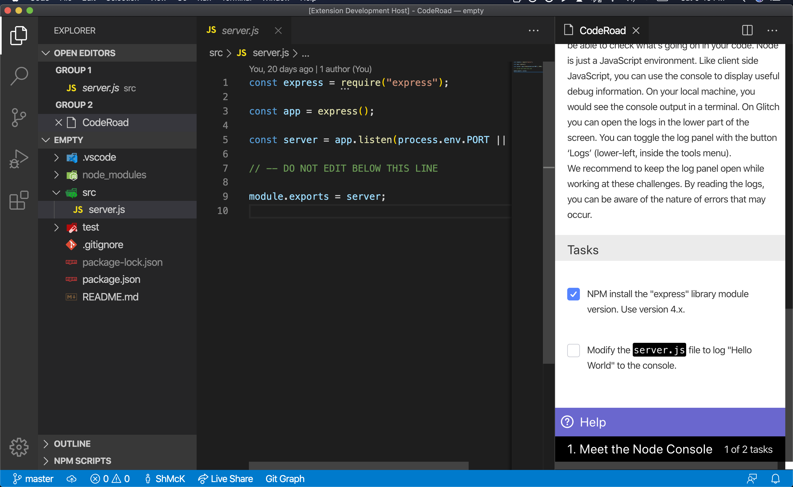

# CodeRoad VSCode

CodeRoad is a VSCode extension that allows you to play interactive coding tutorials in your editor.

## Getting Started

### Launch

To start the extension, inside VSCode:

- Open the VSCode command palette.
  - select “View” > “Command Palette” from the top panel
  - alternatively, press `cmd/ctrl + shift + P`
- Search for and run `CodeRoad:Start`
- A web view should appear on the right side of your editor. Click "Start"

### Requirements

- VSCode 1.40+
  [Download Visual Studio Code - Mac, Linux, Windows](https://code.visualstudio.com/download)
- VSCode command line tools.
  For Mac, installation requires an additional step. See [Running Visual Studio Code on macOS](https://code.visualstudio.com/docs/setup/mac#_launching-from-the-command-line).
- Node.js 10+
- Git

### Installation

> Currently CodeRoad is not yet available in the VSCode marketplace (coming soon!).

To install the extension manually:

- run `vsce package` to build the package.
  Learn more about [VSCE](https://code.visualstudio.com/api/working-with-extensions/publishing-extension)
- run `code —-install-extension coderoad-$VERSION.vsix` where version is the name of the file.
- Reload the window (`ctrl/cmd + R`)
- You should be able to see the extension from the extensions list on the left hand side. Verify that "CodeRoad" is "enabled".

## Creating Tutorials

Build and share your own interactive tutorials.

Learn more about [how tutorials area created](./docs/tutorials.md).

## Contributing

See [CONTRIBUTING.md](./CONTRIBUTING.md).

## License

[AGPL v3](./LICENSE.md)
