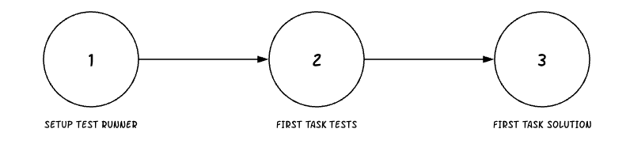

There are really a few major pieces to understand how CodeRoad works.

1. [How Tests Work](#how-tests-work)

2. [How CodeRoad is Built on Git](#built-on-git)

3. [How CodeRoad Hooks & Actions work](#how-hooks-and-actions-work)

### How Tests Work

In CodeRoad, the user is given a set of **levels** composed of one more **tasks**.

Each task is judged to pass (✔) or fail (✘) by the result of code tests that runs in the background. Tests can be triggered by saving a file, or by a trigger that listens to specific files for changes.

If a test fails, the first failing test name is returned to the user as a hint to identify the problem.

Tests might be in another directory. Those folders or files might even be hidden from you by the tutorial creator.

But where does the code for these tests come from?

### Built on Git

CodeRoad tutorials are stored and loaded using Git, a popular version control system. If you're unfamiliar with Git, think of it as a way to save or load progress from checkpoints called "commits".

In a tutorial, these commits have a standardized order. First you setup the test runner, then the task tests, then the solution. This pattern is similar to a kind of development called “TDD” or “test driven development”. Write tests for the problem you want to solve, then save the results when all the tests pass. This pattern can also be used to play out a tutorial like a game: users get a task, then must solve it to continue.

When a tutorial starts, CodeRoad loads git commits from a tutorial up until the first task commit. These commits contain all of the code setup, test runner configuration and tests for the given task.

When a user passes a task, their progress is saved as a commit. Then the next task commit is loaded.

Again notice that the user provides the solution and it is not loaded from the tutorial. This allows users to go a little off-road in a tutorial and provide their own solutions.

#### Why Git

Git provides a number of benefits:

- users can save their progress to a service like GitHub to build a public portfolio
- users can continue working on their project after a tutorial is completed
- software developers are largely familiar with Git, and often TDD, making it easy to create tutorials
- Git provides a mechanism for resolving merge conflicts if they happen to occur
- Git provides a mechanism for "resetting" a tutorial, see more below!

#### Reset

If at some point the user is a bit too “off-road” from the solution, the user can always return to the “golden path” by pressing the **reset** button. The reset button reloads the commits up to that point entirely from the tutorial.

In the example above you can see the user is “reset” back to the original tutorial answers, and back to the second task.

### How Hooks and Actions Work

To make a functional tutorial, tutorial creators need a bit more control over what can be run and when. For example, a test runner wouldn't really work if the package dependencies for that test runner weren't installed.

An **action** is a piece of functionality that can be run. These include:

- `commands` - a list of cli commands to run. For example, "npm install"
- `vscodeCommands` - a list of vscode API commands to run. For example, "setLayout" to change the layout of windows
- `watchers` - a list of files to listen to. If a file changes, the test runner will run automatically
- `files` - a list of files to open in the users workspace to drive the users attention.
- `subtasks` - a task made up of multiple other tests where all must pass to continue
- `filter` - a regex passed into the test runner to limit the tests returned

A **hook** in CodeRoad is a place where a tutorial creator can tap in to run an action. Hooks include:

- `config.setup` - when the tutorial setup. This is a great place to setup your test runner.
- `task.setup` - when a task is started
- `task.solution` - when a solution is loaded from a [reset](#reset)

Hooks and actions combined provide a flexible environment for tutorial development.
